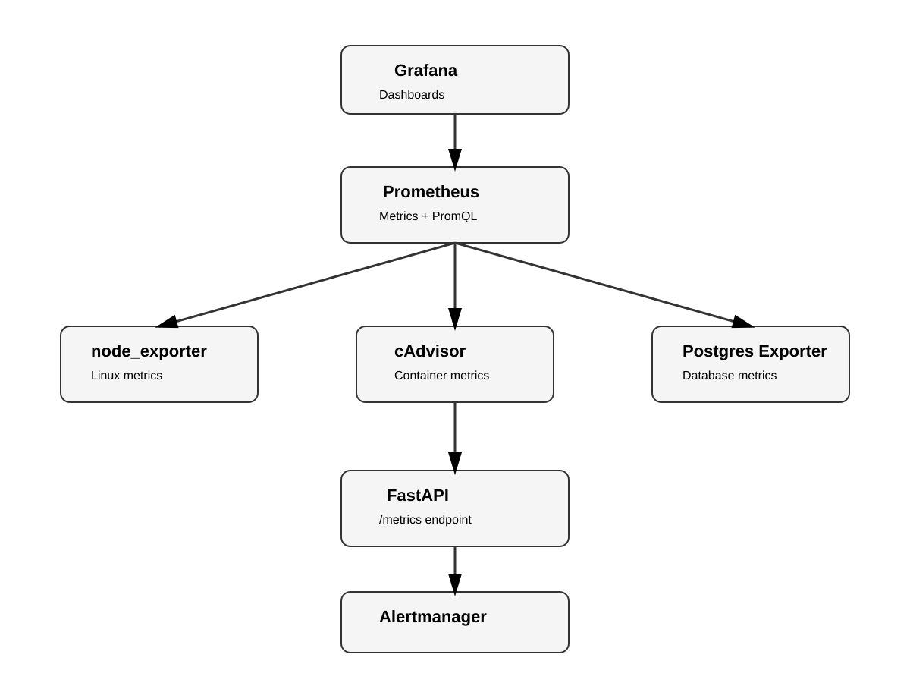

# Monitoring Stack with Prometheus, Grafana & Docker Compose

A production-style monitoring and observability stack built using Docker Compose.

This project demonstrates how to collect, visualize, and alert on infrastructure, container, database, web server, and application metrics using the Prometheus ecosystem.
*Screenshots and Other Implemented Features to be added to README.md soon.*
---

# Overview

The goal of this project was to build a complete monitoring platform capable of:

- Collecting metrics
- Storing time-series data
- Creating operational dashboards
- Detecting abnormal conditions
- Generating alerts

The stack monitors:

- Linux host resources
- Docker containers
- PostgreSQL database
- NGINX web server
- FastAPI application metrics

---

# Architecture




---

# Technologies

| Component | Purpose |
|---|---|
| Docker Compose | Containerized deployment |
| Prometheus | Metrics collection and querying |
| Grafana | Visualization and dashboards |
| Alertmanager | Alert processing and routing |
| node_exporter | Linux host metrics |
| cAdvisor | Docker container metrics |
| postgres_exporter | PostgreSQL monitoring |
| nginx-prometheus-exporter | NGINX metrics |
| FastAPI | Instrumented application |

---

# Implemented Features

## Infrastructure Monitoring

Monitoring of:

- CPU usage
- Memory usage
- Disk usage
- Network statistics

Using:

- node_exporter
- Prometheus
- Grafana

---

## Container Monitoring

Using cAdvisor:

- Container memory usage
- Container filesystem usage
- Container resource metrics

---

## Database Monitoring

Using postgres_exporter:

- PostgreSQL statistics
- Database activity metrics

---

## Web Server Monitoring

Using nginx-prometheus-exporter:

- NGINX traffic
- Active connections
- Request metrics

---

## Application Observability

The FastAPI application exposes:

```
/metrics
```

Implemented:

- HTTP request counters
- Route-based labels
- Latency histograms
- Average latency calculation
- P95 latency monitoring

Example PromQL:

```promql
histogram_quantile(
  0.95,
  rate(app_http_request_duration_seconds_bucket[5m])
)
```

---

## Alerting

Implemented:

- Prometheus alert rules
- Alertmanager integration
- Alert lifecycle testing

Alert flow:

```
Metric
  |
  v
PromQL condition
  |
  v
Prometheus Alert Rule
  |
  v
Alertmanager
  |
  v
Notification Channel
```

---

# Project Structure

```
monitoring-stack/
|
├── docker-compose.yml
|
├── app/
|
├── prometheus/
|
├── alertmanager/
|
├── grafana/
|
└── nginx/
```

---

# Future Improvements

- Notification channels (Telegram/Slack/Email)
- CI/CD pipeline
- Automated deployment
- Kubernetes deployment
